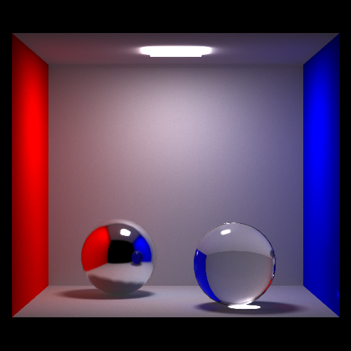
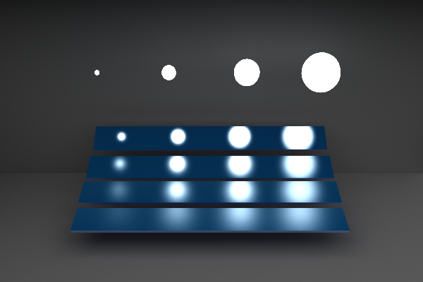
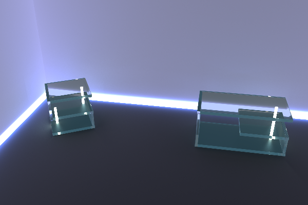
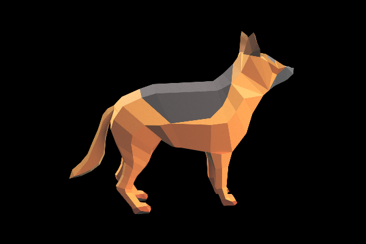

# Monte Carlo Path Tracing 蒙特卡洛光线追踪

## 依赖库

- freeglut 3.0
- Eigen 3.3.4
- Lua 5.3
- Sol 2.19
- stb 中的`stb_image_write.h`

## 各平台运行指南

### Windows

- Visual Studio 2015 x64
- 依赖库已经配置好，直接可以编译运行。
- 也可以通过双击脚本`run_xxx.bat`直接运行可执行程序。
- 运行参数可通过工程->属性->配置属性->调试,在右侧"命令参数“处设置；第一个参数即为lua脚本文件。

### Linux

- ubuntu 16.04
- GCC (>= 5)
- 需要安装的额外依赖
```bash
sudo apt install libreadline-dev freeglut3-dev
```
- 运行步骤（以scene01为例）
```cmake
cd path/to/this/project
mkdir build && cd build
cmake .. -DCMAKE_BUILD_TYPE=RELEASE
make & cd ..
./build/path_tracing ./config/scene01.lua
```


### macOS
- 需要安装的额外依赖
```bash
brew cask install xquartz
brew install freeglut gcc lua
```
- 运行步骤（以scene01为例）
```cmake
cd path/to/this/project
mkdir build & cd build
cmake .. -DCMAKE_BUILD_TYPE=RELEASE
make & cd ..
./build/path_tracing ./config/scene01.lua
```

- macOS下的clang经过测试也可以正常编译运行，只需要去除filesystem以及OpenMP的依赖。

## 场景测试

### 渲染结果


<center>Scene01 </center>


<center>Scene02</center>


<center>Vase</center>


<center>Table</center>


<center>Dog</center>
